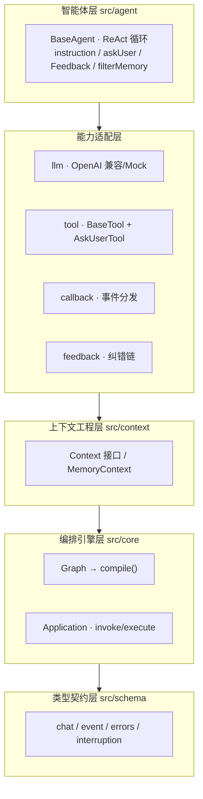
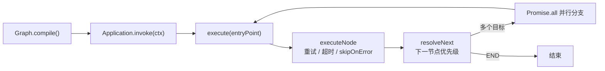
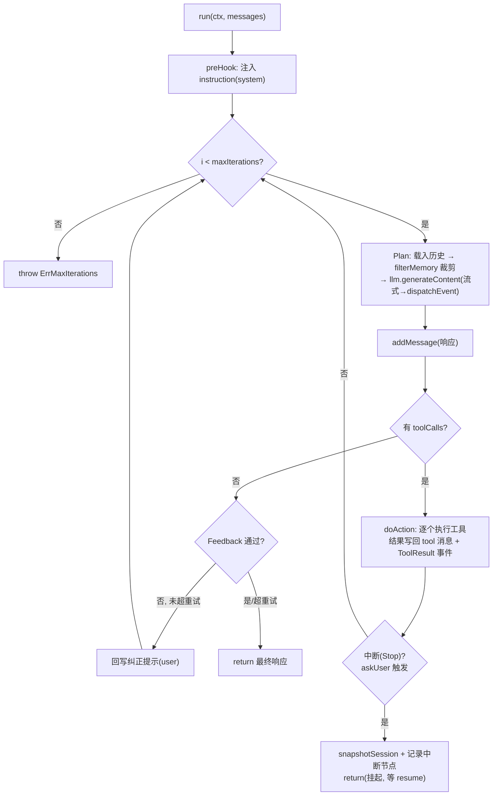
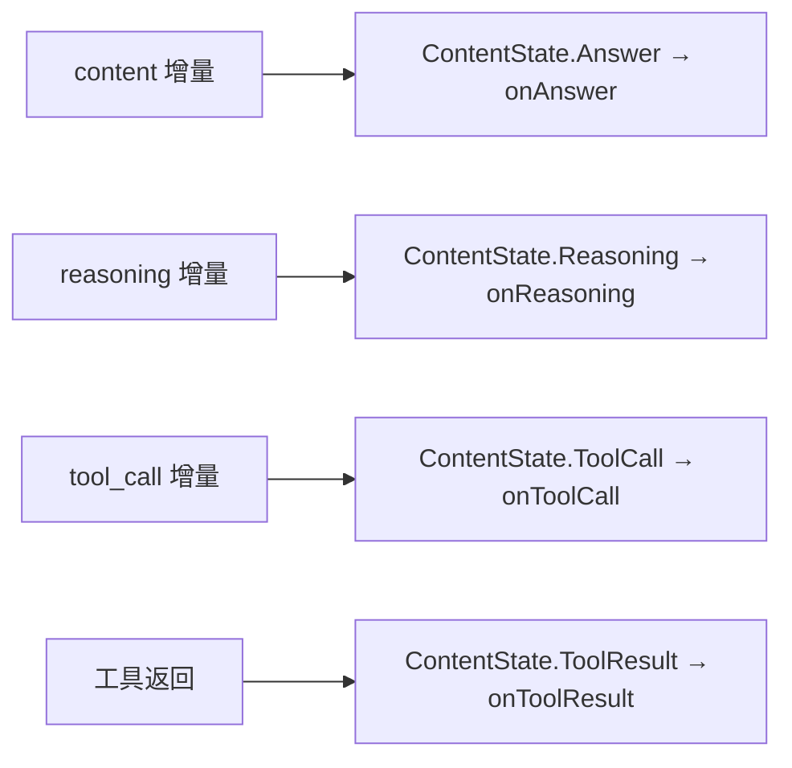

# nexus-sdk-ts

> OceanAI Agent SDK v2.0 的 **Bun + TypeScript** 移植版。
> 源项目为 Go 模块 `code.byted.org/ad/nexus`（约 4.1 万行 / 210 个 .go 文件），核心是一套
> **LangGraph 风格的 DAG 编排引擎 + ReAct 智能体循环 + 三层上下文工程**。本仓库从 P0 核心层起步，
> 目标是不依赖任何字节内部基础设施即可本地闭环运行。

---

## 这是什么

一个**构建 Agent 应用的库 / SDK**（不是可执行程序）。它提供三块能力：

1. **DAG 编排引擎** —— 把工作流描述为有向图（节点 + 边 + 跳转指令），引擎负责调度、并发、重试、超时、中断恢复。
2. **ReAct 智能体** —— `Plan → 调用工具 → 观察结果 → 迭代` 的标准循环，内置最大迭代保护。
3. **可插拔的 LLM / Tool / Callback** —— LLM 走 OpenAI 兼容协议（含火山方舟），工具用 JSON Schema 描述，流式事件经统一回调分发。

当前实现的是 **P0 核心层**（语言无关、可独立验证）；字节内部强耦合能力（OceanAI / ByteRAG / Sandbox 等）在 `src/infra` 留了接口占位，走后续远程代理。

---

## 快速开始

```bash
bun install

bun run dev          # 最小 DAG 示例（3 节点流转）
bun test             # 全部单测（core + agent + HITL/Feedback + middleware/resume）
bun run typecheck    # tsc --noEmit
bun run build        # 打包到 dist/

bun run agent        # 带工具调用的 ReAct 示例（无 Key 走 Mock，有 Key 真连）
bun run check:llm    # 大模型连通性自测（纯文本流式）
```

### 接真实大模型（火山方舟 / OpenAI）

代码走 OpenAI 兼容的 `/chat/completions`，火山方舟同端点零改动即可用。复制 `.env.example` 配置后：

```bash
export ARK_API_KEY="你的方舟ApiKey"        # 填裸 Key，代码自动加 Bearer 前缀
export ARK_MODEL="ep-xxxxxxxxxxxx"          # 接入点ID，或模型名 doubao-seed-2-0-pro-260215
# ARK_BASE_URL 缺省 = https://ark.cn-beijing.volces.com/api/v3

bun run check:llm     # 先验证 Key 通
bun run agent         # 再跑完整工具调用闭环
```

> 也支持标准 OpenAI：设 `OPENAI_API_KEY` / `OPENAI_BASE_URL` / `OPENAI_MODEL`（优先级高于 ARK_*）。

---

## 目录结构

```
src/
├── schema/      类型契约（所有模块基石）
│   ├── chat.ts          消息 / 工具调用 / 多模态 part / 响应
│   ├── event.ts         ContentState 流式内容态 + Event
│   ├── errors.ts        NexusError 体系（ErrMissingLLM / ErrMaxIterations ...）
│   ├── interruption.ts  中断状态与序列化
│   └── runconfig.ts     AgentRunRequest 等运行入参
├── core/        DAG 编排引擎
│   ├── command.ts       Command{goto,update} + 便捷构造器 + END
│   ├── node.ts          Node / NodeConfig（重试/超时/skipOnError）
│   ├── graph.ts         Graph：addNode/addEdge/addConditionalEdge/compile
│   └── application.ts   编译后的可执行图：invoke → 递归 execute
├── context/     上下文工程
│   ├── context.ts       Context 接口（消息/状态/产物/中断）
│   └── memory.ts        MemoryContext 纯内存参考实现
├── llm/         模型适配层
│   ├── llm.ts           LLM 接口 + GenerateOptions
│   ├── openai.ts        OpenAI 兼容实现（Bun fetch + SSE 流式增量）
│   ├── adapter.ts       schema <-> OpenAI wire 双向转换
│   ├── factory.ts       从环境变量建 LLM（兼容 ARK_* / OPENAI_*）
│   ├── mock.ts          MockLLM 离线脚本化（测试/示例用）
│   └── message.ts       消息构造器
├── tool/        工具抽象（BaseTool / AbstractTool）+ AskUserTool（HITL）
├── callback/    流式回调（Callback 接口 + dispatchEvent 事件分发）
├── agent/       智能体
│   ├── base.ts          BaseAgent ReAct 主循环（instruction/askUser/Feedback/filterMemory）
│   ├── agent.ts         Agent 接口（run / resume / stop）
│   └── option.ts        AgentOptions + 默认值（maxIterations=30, maxFeedbackRetries=3）
├── feedback/    反馈纠错链（Chain / JSONFeedback / FuncFeedback）
│   └── feedback.ts      产出→评估→未通过回写提示重试
├── node/        节点级封装(对应 Go node/)
│   └── human-in-loop.ts 节点级 HITL:中断→询问用户→恢复执行(审批/反问卡点)
├── prompt/      Plan 模板层（对应 Go prompt/）
│   └── template.ts      Roadmap(Block/RecentTurns/Current)+工具清单 → 系统指令
└── infra/       应用层 + 字节内部基础设施适配
    ├── server.ts        P1：Bun.serve() SSE 服务端出口（占位）
    ├── oceanai.ts       P2：OceanAI REST + AutoCompaction 摘要远程代理
    ├── sandbox.ts       P2：AI-Sandbox 执行代理
    └── rag.ts           P2：ByteRAG 检索代理

examples/   minimal.ts（DAG）/ agent-tools.ts（ReAct+工具）/ check-llm.ts（连通性）/ resume.ts（断点续跑）/ ask-user.ts（工具级 HITL）/ hil-node.ts（节点级 HITL 审批）
test/       core.test.ts（引擎）/ agent.test.ts（ReAct）/ agent-advanced.test.ts（HITL/Feedback）/ middleware-resume.test.ts / human-in-loop.test.ts（节点级 HITL）
```

---

## 分层架构



---

## Go → TS 分层映射规则

Go 版 Nexus 是六层架构。移植到本仓库时，**层级语义一一对应，但目录归属做了重组**：Go 把 `Graph/Application/Node` 都放在 `schema/` 包里，TS 版把「可执行的编排引擎」单独拆到 `src/core/`，`src/schema/` 只保留纯类型 / 接口。

| Go 层级 | Go 位置 | → 本仓库位置 | 状态 |
|---|---|---|---|
| 应用层 HTTP/Lark Bot/MCP Server | `deploys/` | `src/infra/server.ts` + 未来 `Bun.serve()` | 🔌 占位 |
| 编排层 Graph + Application | `schema/graph.go`、`schema/application.go` | **`src/core/`** | ✅ 已落地 |
| 智能体层 BaseAgent/SkillAgent/FornaxAgent | `agent/` | `src/agent/` | 🟡 BaseAgent（含 askUser/HITL、instruction、Feedback、filterMemory），Skill/Fornax 待接 |
| 上下文层 NexusContext/OceanAIContext + Roadmap | `context/` | `src/context/` + `src/schema/roadmap.ts` | 🟡 Roadmap 数据结构 + MemoryContext 全量已落地；填充/压缩走远端（`src/infra/oceanai.ts`）|
| 能力层 LLM/Tool/Callback/Feedback/Eval/Node | `llm/ tool/ callback/ feedback/ ...` | `src/llm/`、`src/tool/`、`src/callback/`、`src/feedback/` | 🟡 LLM/Tool/Callback/Feedback 已落地，Eval 待接 |
| 基础层 schema 接口、prompt/log/utils | `schema/`、`prompt/`、`log/`、`utils/` | **`src/schema/`** + `src/prompt/` | 🟡 缺 log/utils |

**几条要记住的映射规则：**

1. **`schema/` 一拆为二** —— Go 的 `schema/` 同时包含「引擎实现」与「类型接口」；TS 版把可执行的 Graph/Application/Node/Command 拆到 `src/core/`，纯类型留在 `src/schema/`。这是与原架构图最大的不同点。
2. **能力层子包提升为顶层目录** —— Go 的 `llm/openai`、`tool/mcp`、`tool/rag` 等包内子目录，在 TS 版提升为 `src/llm/`、`src/tool/` 顶层目录，内部用文件区分（如 `llm/openai.ts`、`llm/factory.ts`）。
3. **应用层（deploys）后置** —— HTTP/MCP Server 用 `Bun.serve()` 重写（`src/infra/server.ts`，P1）；OceanAI/Lark 等内部平台耦合走 `src/infra/` 远程代理（P2）。
4. **基础层 prompt/log/utils** —— `prompt/`（Plan 模板）已建骨架；`log/`、`utils/` 按需补。FornaxAgent / Fornax LLM 等字节内部实现统一收敛到 P2 远程代理，不在本地重建。

---

## 核心数据流

### 1) DAG 引擎执行（编排层）



**下一节点优先级**：`Command.goto` > 条件边(Conditional Edge) > 静态边(Static Edge) > `END`。
并发用 `Promise.all`（对应 Go 的 errgroup），超时用 `Promise.race + AbortController`（对应 `context.WithTimeout`）。

### 2) ReAct 智能体循环（BaseAgent）



### 3) 流式事件分发（callback）

LLM 的增量 delta 被拆成三类，经 `dispatchEvent` 映射到统一回调：



`src/llm/openai.ts` 负责逐行解析 SSE（`data:` 行、`[DONE]` 终止、跨 chunk 缓冲），并按 `index` 把被切碎的 tool-call `arguments` 拼接完整。

---

## 三个示例怎么用

| 示例 | 跑什么 | 是否需要 Key |
|---|---|---|
| `examples/minimal.ts` | 纯引擎：plan → act → finish 三节点 DAG | 否 |
| `examples/agent-tools.ts` | ReAct + calculator 工具，算 `(1+2)*3` | 否（Mock）/ 是（真连） |
| `examples/check-llm.ts` | 纯文本流式连通性自测 | 是 |
| `examples/resume.ts` | 断点续跑：下单→审批中断→序列化→恢复重放 | 否 |
| `examples/ask-user.ts` | Human-in-the-Loop：askUser 挂起→用户回答→resume 续跑 | 否 |
| `examples/hil-node.ts` | 节点级 HITL：审批图 plan→approve(中断)→execute/reject | 否 |

最小 DAG 用法：

```ts
import { Graph, gotoNode, gotoEnd, updateState } from "./src/index.ts";
import { MemoryContext } from "./src/context/memory.ts";

const g = new Graph();
g.addNode({ name: "plan", func: async () => gotoNode("act") });
g.addNode({ name: "act",  func: async () => updateState({ done: true }) });
g.addNode({ name: "finish", func: async () => gotoEnd() });
g.addEdge("act", "finish");
g.setEntryPoint("plan");

const ctx = new MemoryContext({ query: "hello" });
await g.compile().invoke(ctx);
```

---

## 迁移进度（P0 / P1 / P2）

| 优先级 | 范围 | 状态 |
|---|---|---|
| **P0** 语言无关核心 | schema / DAG 引擎 / 内存 Context / LLM 接口 / Tool / Callback / BaseAgent | ✅ 已实现并单测 |
| **P1** 生态平替 | MCP（@modelcontextprotocol/sdk）、Lark SDK、TOS/TCC | ⏳ 待接 |
| **P2** 字节内部强耦合 | OceanAI REST、ByteRAG、Sandbox、Trace、JWT、AutoCompaction 摘要 | 🔌 `src/infra` 留接口，走远程代理 |

> AutoCompaction 摘要继续复用远端 OceanAI 服务，不在本地重建摘要逻辑——这是源项目的关键架构约束。

### P0 核心引擎能力清单

| 能力 | 对齐 Go | 状态 | 位置 / 验证 |
|---|---|---|---|
| Graph / Application 递归执行 | `schema/application.go` | ✅ | `src/core/application.ts` |
| 并发分支 / 重试 / 超时 / skipOnError | `errgroup` + `NodeConfig` | ✅ | `executeNode`，`test/core.test.ts` |
| **Middleware 流转优先级** | `resolveNext` 顶层 | ✅ | `graph.useMiddleware()`，`test/middleware-resume.test.ts` |
| **中断恢复 resume / replay** | `InterruptionState` 续跑 | ✅ | `ctx.resume()` + 从中断节点重放，`test/middleware-resume.test.ts` |
| 三层 Roadmap / AutoContextEditing | `context/` 治理 | 🟡 | 三层结构(Block/RecentTurn/Current)+Artifact 完整类型已迁移，`test/context.test.ts`；填充与 AutoCompaction 摘要为 P2 远端（OceanAI），本地 `MemoryContext` 提供 no-op 钩子 |

> 流转优先级现已完整对齐 Go：**Middleware > Command.goto > 条件边 > 静态边 > END**；中断支持「同进程恢复」与「序列化跨进程恢复」两种重放路径，端到端用法见 `examples/resume.ts`。

### 智能体层能力清单（BaseAgent）

| 能力 | 对齐 Go | 状态 | 位置 / 验证 |
|---|---|---|---|
| ReAct 闭环（Plan→Act→迭代） | `agent/base.go` | ✅ | `src/agent/base.ts`，`test/agent.test.ts` |
| **name/desc/llm 构造校验** | `NewBaseAgent` 缺失即报错 | ✅ | 构造期抛 `ErrMissingName`/`ErrMissingDesc`/`ErrMissingLLM`，`test/agent-parity.test.ts` |
| **生命周期回调** | `AgentStart/End`、`LLMStart/End`、`ToolStart/End` | ✅ | `onAgentStart/End`、`onLLMStart/End`、`onToolStart/End` 包裹 run/plan/doAction，`test/agent-parity.test.ts` |
| **逐工具 Feedback 拦截** | `Plan` 内 `fdchain.Feedback(..,&call)` | ✅ | 工具分支每个 toolCall 跑 feedback，未过用 prompt 覆盖结果，`test/agent-parity.test.ts` |
| **vars + go-template 指令渲染** | `Plan` inputs + `prompt.Format` | ✅ | 注入 `name/current/prompt/with_context` + 自定义 vars，零依赖 `formatGoTemplate`，`test/agent-parity.test.ts` |
| **工具合并去重** | `Plan`: `GetTools()` 合并 + `slices.Contains` 去重 | ✅ | `opts.tools` + `ctx.getTools()` + askUser，按 name 去重，`test/agent-parity.test.ts` |
| **instruction 注入（preHook）** | `agent.WithInstruction` | ✅ | `preHook()` 注入 system 消息（仅一次），`test/agent-advanced.test.ts` |
| **askUser / 工具级 HITL** | `tool/askuser_tool.go` | ✅ | `AskUserTool`→`ctx.interrupt` 挂起，`agent.resume(ctx, answer)` 续跑，`test/agent-advanced.test.ts` |
| **HumanInLoopNode / 节点级 HITL** | `node/human_in_loop.go` | ✅ | `newHumanInLoopNode({askFunc, resumeFunc})` 图内固定审批/反问卡点，`src/node/human-in-loop.ts`，`test/human-in-loop.test.ts` |
| **Feedback 纠错链** | `feedback/`（Chain/JSONFeedback） | ✅ | `src/feedback/`，未通过回写提示重试，`test/agent-advanced.test.ts` |
| **filterMemory 记忆裁剪** | `agent.WithFilterMemoryFunc` | ✅ | Plan 前裁剪历史（AutoContextEditing 钩子），`test/agent-advanced.test.ts` |
| SkillAgent / CodeAgent / A2AAgent / HttpAgent / FornaxAgent / OceanAIAgent | `agent/skill_agent.go` 等 6 个 | 🔌 | 强耦合字节内部包，`src/infra` 远程代理占位（详见下文）|

> askUser 把 HITL 实现为「普通工具 + 中断」：工具调用 `ctx.interrupt(question)` 把会话置为 `Stop`，BaseAgent 在 `doAction` 后检测到 Stop 即 `snapshotSession()` 快照状态并优雅退出；拿到用户回答后 `agent.resume(ctx, answer)` 把回答回填、清除中断标记并从中断点续跑。端到端见 `examples/ask-user.ts`。
>
> 两种 HITL 触发方式:**askUser Tool 是工具调用级**(由 LLM 在 ReAct 循环中自行决定何时反问);**HumanInLoopNode 是节点级**(在图里固定位置由编排流程触发,适合确定性审批卡点)。节点首次进入即 `askFunc` 发问并 `Stop` 中断,引擎快照退出;携带用户回答的上下文 `ctx.resume(state)` 后续跑,`resumeFunc(ctx, userInput)` 返回 `{interrupt}` 决定「再追问 / 通过(返回 `next` 路由) / 驳回」,支持多轮追问。端到端见 `examples/hil-node.ts`。

---

### P2 智能体（字节内部强耦合，`src/infra` 远程代理占位）

下列 6 个 Agent 在 Go 源码中直接依赖字节内部包，**不在本地重建其内部逻辑**，按 P2 走远程代理；本仓库只提供接口隔离与占位说明（见 `src/infra/`）：

| Go Agent | 内部耦合点 | 为什么不本地移植 | TS 策略 |
|---|---|---|---|
| `SkillAgent`（`skill_agent.go`） | Skill / MCP 加载器、内部技能注册中心 | 依赖内部技能仓与鉴权 | 远程代理调用，`src/infra` 留接口 |
| `CodeAgent`（`code_agent.go`） | 本地 **SSE 服务（端口 9100）** + 代码沙箱 | ⛔ 沙箱禁止监听端口的进程，无法平移 | 仅经远程沙箱服务调用，不在本地起服务 |
| `A2AAgent`（`a2a_agent.go`） | Agent-to-Agent 内部协议 / A2UI 渲染 | 依赖内部 A2UI 协议与服务发现 | 远程代理 |
| `HttpAgent`（`http_agent.go`） | 内部网关鉴权 / PSM 寻址 | 依赖内部服务网格 | 远程代理 |
| `FornaxAgent`（`fornax_agent.go`） | Fornax 平台 SDK | 依赖 Fornax 内部平台 | 远程代理 |
| `OceanAIAgent`（`oceanai_agent.go`） | OceanAI Session / AutoCompaction 摘要 | 摘要逻辑由远端 OceanAI 服务承担 | 复用远端服务，不本地重建摘要 |

> 这与「AutoCompaction 摘要复用远端 OceanAI」是同一条架构约束:**可移植的语言无关逻辑(P0)本地实现并单测;强耦合内部基础设施(P2)一律走远程代理**,避免把字节内部依赖硬塞进开源 SDK。`CodeAgent` 的本地 SSE 服务还额外违反沙箱「禁止监听端口」红线,故只能远程化。

---

## Go → TypeScript 关键映射

| Go 机制 | 本项目对应 |
|---|---|
| goroutine + errgroup | `async/await` + `Promise.all` |
| `context.WithTimeout` | `Promise.race` + `AbortController` |
| `context.Context` 取消 | `AbortController` / `AbortSignal` 贯穿调用链 |
| error 多返回值 | 抛 `NexusError` 子类 |
| `sync.Map` | `Map`（单线程无需锁） |
| `kin-openapi/openapi3.Schema` | JSON Schema |
| 增量拼接 delta | SSE 逐 chunk 累积（`openai.ts`） |

---

## 技术栈

Bun 1.3+ · TypeScript 5.6（strict）· 无运行时第三方依赖（核心层）。测试用内置 `bun:test`，打包用 `bun build`。
